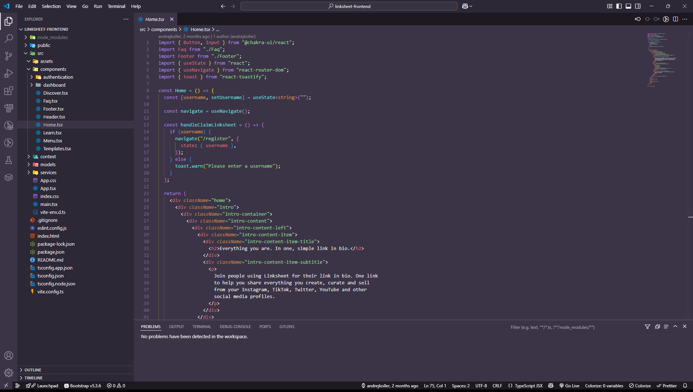
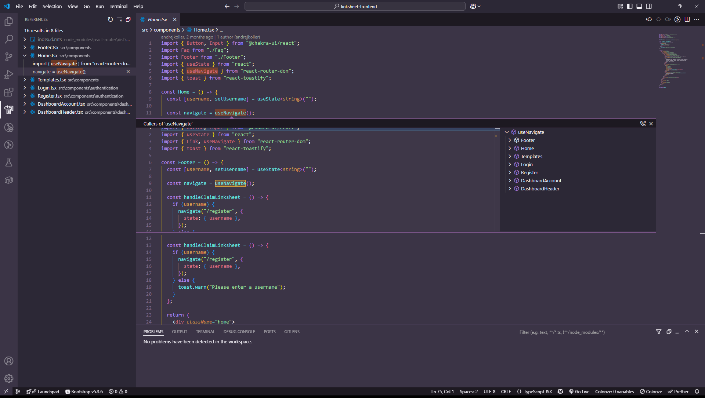
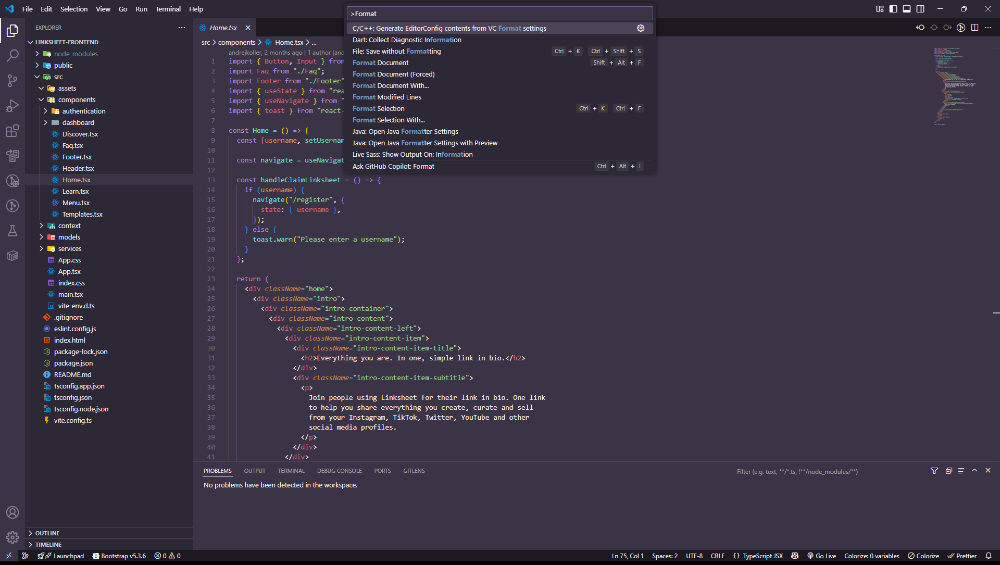
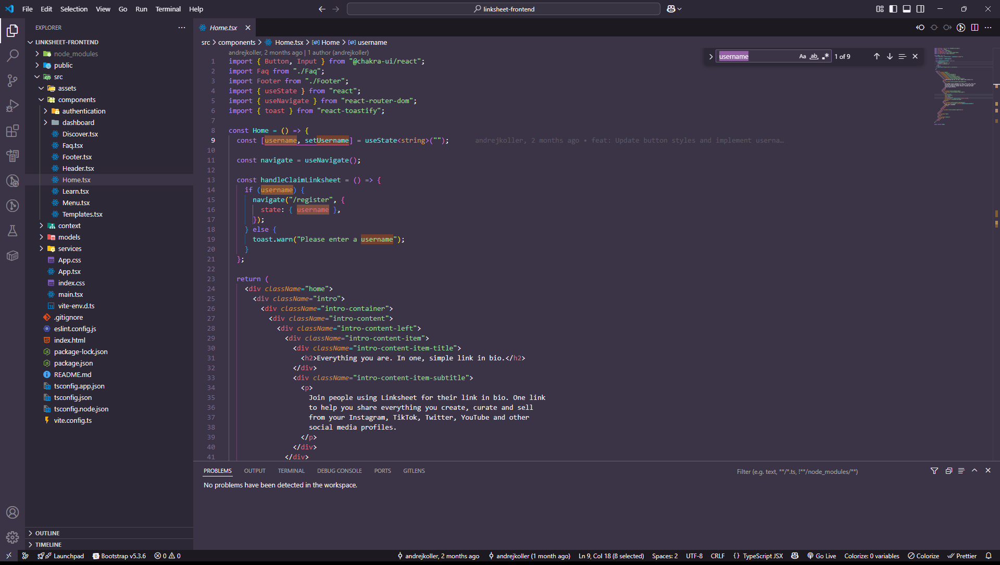

# 🌙 Arabian Nights for [Visual Studio Code](http://code.visualstudio.com)

**Arabian Nights** is a mystical and elegant dark theme for Visual Studio Code, inspired by the enchanted tales of the Middle East. With deep purples, soft ambers, and twilight blues, it brings a unique atmosphere to your development environment.

## ✨ Features

- Carefully balanced color palette
- Comfortable for long coding sessions
- Stylized syntax highlighting
- Themed terminal and merge colors
- Perfect for night owls and dreamers

## 🖼️ Preview

## 📥 Installation

1. Press `Ctrl+P` or `Cmd+P` in VS Code
2. Type `ext install andrejkoller.arabian-nights-theme`
3. Activate the theme via `Preferences: Color Theme`

## 💜 Inspired by

The magic and mystery of the _One Thousand and One Nights_ — woven into your code editor.
